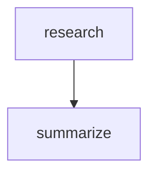

# Workflows & Declarative Agents

> **Errata (April 2026).** An earlier draft of this page described an `agent_framework.graphs` module with classes like `AgentGraph`, `GraphNode`, `GraphEdge`, `ConditionalEdge`, `CheckpointConfig`, `HITLConfig`, `TimeTravelConfig`, `ErrorPolicy`, and `ObservabilityConfig`. **None of those classes exist** in the `agent-framework` package. This page was rewritten after direct introspection of `agent-framework-core==1.1.0` and `agent-framework-declarative==1.0.0b260421`.

Two real capabilities ship under this umbrella:

1. **Imperative workflows** — `WorkflowBuilder` in `agent-framework-core`. Composable graphs with fan-in/fan-out/switch-case routing, checkpointing, and `WorkflowAgent` wrapping.
2. **Declarative agents/workflows** — `agent-framework-declarative` package with `AgentFactory` and `WorkflowFactory` that load agents and workflows from YAML.

## Imperative workflows — the real API

### Install

```bash
pip install agent-framework
```

The workflow types are exported from the top-level `agent_framework` package.

### Primitives (verified against `agent-framework-core==1.3.0`)

| Class / function | Purpose |
|---|---|
| `Workflow` | Compiled, runnable workflow. |
| `WorkflowBuilder(start_executor=..., name=..., description=..., max_iterations=100, checkpoint_storage=None, output_executors=None)` | Fluent builder that returns a `Workflow` from `.build()`. |
| `Executor(id, ...)` | Base class for workflow nodes. Subclass or use `FunctionExecutor` to wrap a plain function. |
| `FunctionExecutor(func, id=None, *, input=None, output=None, workflow_output=None)` | Wraps a sync or async Python callable. |
| `WorkflowAgent(workflow, *, id, name, description, context_providers, ...)` | Exposes a compiled `Workflow` as an `Agent` — so workflows can be used interchangeably with single agents. |
| `Edge`, `EdgeCondition`, `FanInEdgeGroup`, `FanOutEdgeGroup`, `SingleEdgeGroup`, `SwitchCaseEdgeGroup`, `Case`, `Default` | Edge types — typically you don't instantiate these directly; `WorkflowBuilder` does it for you. |
| `CheckpointStorage` (protocol), `InMemoryCheckpointStorage`, `FileCheckpointStorage(storage_path, *, allowed_checkpoint_types=None)` | Checkpointing. Pass via `checkpoint_storage=` on the builder. |
| `WorkflowContext`, `WorkflowEvent`, `WorkflowEventSource`, `WorkflowEventType`, `WorkflowRunResult`, `WorkflowRunState`, `WorkflowMessage` | Runtime types for events, results, and messages. |
| `WorkflowViz` | Visualisation helper. |
| `validate_workflow_graph` | Top-level function that checks edge consistency before `.build()` if you want early validation. |

### Verified signature

```python
WorkflowBuilder(
    max_iterations: int = 100,
    name: str | None = None,
    description: str | None = None,
    *,
    start_executor: Executor | SupportsAgentRun,
    checkpoint_storage: CheckpointStorage | None = None,
    output_executors: list[Executor | SupportsAgentRun] | None = None,
)
```

Builder methods (all return `Self` for chaining):

- `.add_edge(source, target, condition=None)` — fixed or conditional edge.
- `.add_chain(executors)` — shorthand for a linear `A → B → C`.
- `.add_fan_out_edges(source, targets)` — one-to-many fan-out.
- `.add_fan_in_edges(sources, target)` — many-to-one fan-in (target waits for all sources).
- `.add_multi_selection_edge_group(source, targets, selection_func)` — dynamic fan-out where a selector function returns the subset of target IDs to run.
- `.add_switch_case_edge_group(source, cases)` — switch/case routing on the payload.
- `.build() → Workflow`.

### Minimum viable workflow

```python
from agent_framework import WorkflowBuilder, FunctionExecutor, InMemoryCheckpointStorage

def research(query: str) -> dict:
    return {"findings": f"Results for: {query}"}

def summarize(findings: dict) -> str:
    return f"Summary: {findings['findings']}"

research_node = FunctionExecutor(research, id="research")
summarize_node = FunctionExecutor(summarize, id="summarize")

workflow = (
    WorkflowBuilder(
        start_executor=research_node,
        name="ContentPipeline",
        checkpoint_storage=InMemoryCheckpointStorage(),
    )
    .add_edge(research_node, summarize_node)
    .build()
)
```

### Conditional routing (switch/case)

```python
from agent_framework import WorkflowBuilder, FunctionExecutor, Case, Default

def route(payload: dict) -> str:
    return payload.get("kind", "unknown")

def billing(payload: dict) -> str: return "handled by billing"
def refund(payload: dict) -> str: return "handled by refund"
def fallback(payload: dict) -> str: return "general support"

classify = FunctionExecutor(route, id="classify")
b = FunctionExecutor(billing, id="billing")
r = FunctionExecutor(refund, id="refund")
f = FunctionExecutor(fallback, id="fallback")

workflow = (
    WorkflowBuilder(start_executor=classify)
    .add_switch_case_edge_group(
        classify,
        cases=[
            Case(condition=lambda out: out == "billing", target=b),
            Case(condition=lambda out: out == "refund", target=r),
            Default(target=f),
        ],
    )
    .build()
)
```

### Fan-out / fan-in (parallel workers)

```python
def split(task: dict) -> list[dict]: ...
def work(item: dict) -> dict: ...
def merge(results: list[dict]) -> dict: ...

splitter  = FunctionExecutor(split,  id="split")
worker_a  = FunctionExecutor(work,   id="worker_a")
worker_b  = FunctionExecutor(work,   id="worker_b")
worker_c  = FunctionExecutor(work,   id="worker_c")
collector = FunctionExecutor(merge,  id="collect")

workflow = (
    WorkflowBuilder(start_executor=splitter)
    .add_fan_out_edges(splitter, [worker_a, worker_b, worker_c])
    .add_fan_in_edges([worker_a, worker_b, worker_c], collector)
    .build()
)
```

### Exposing a workflow as an agent

```python
from agent_framework import WorkflowAgent

agent = WorkflowAgent(
    workflow=workflow,
    name="ContentPipelineAgent",
    description="Runs research → summarize",
)

response = await agent.run("Latest AI research")
print(response.text)
```

### Conditional edge — `add_edge` with a condition

Pass a `condition` callable to `.add_edge()` to gate activation of the target executor. The target is skipped when the predicate returns `False`:

```python
from agent_framework import FunctionExecutor, WorkflowBuilder

def score(text: str) -> dict:
    words = text.split()
    return {"text": text, "score": len(words) / 100}

def accept(payload: dict) -> str:
    return f"Accepted: {payload['text']}"

def reject(payload: dict) -> str:
    return f"Rejected: {payload['text']}"

score_node  = FunctionExecutor(score,  id="score")
accept_node = FunctionExecutor(accept, id="accept")
reject_node = FunctionExecutor(reject, id="reject")

workflow = (
    WorkflowBuilder(start_executor=score_node)
    .add_edge(score_node, accept_node, condition=lambda out: out["score"] >= 0.5)
    .add_edge(score_node, reject_node, condition=lambda out: out["score"] <  0.5)
    .build()
)
```

The `condition` callable receives the output value of the source executor and must return `bool`.

### Collecting outputs from specific nodes — `output_executors`

`result.get_outputs()` collects only values explicitly emitted via `ctx.yield_output()` — plain function return values are **not** captured. Pass `output_executors=` to further restrict which nodes' `yield_output` calls are included, useful when only some branches should contribute to the final result:

```python
from agent_framework import FunctionExecutor, WorkflowBuilder, WorkflowContext


def split(query: str) -> dict:
    return {"query": query}


async def web_search(payload: dict, ctx: WorkflowContext[str, str]) -> None:
    result = f"web: {payload['query']}"
    await ctx.yield_output(result)   # emitted into get_outputs()


async def db_lookup(payload: dict, ctx: WorkflowContext[str, str]) -> None:
    result = f"db: {payload['query']}"
    await ctx.yield_output(result)   # emitted into get_outputs()


async def audit_log(payload: dict, ctx: WorkflowContext) -> None:
    print(f"Audit: {payload['query']}")   # side-effect only — no yield_output call


splitter = FunctionExecutor(split,      id="split")
web      = FunctionExecutor(web_search, id="web")
db       = FunctionExecutor(db_lookup,  id="db")
audit    = FunctionExecutor(audit_log,  id="audit")

# output_executors filters which yield_output calls reach get_outputs();
# the audit node calls no yield_output so it would be excluded regardless
workflow = (
    WorkflowBuilder(
        start_executor=splitter,
        output_executors=[web, db],
    )
    .add_fan_out_edges(splitter, [web, db, audit])
    .build()
)

import asyncio
result  = asyncio.run(workflow.run("latest AI news"))
outputs = result.get_outputs()   # ['web: latest AI news', 'db: latest AI news']
```

### Checkpointing and resume

```python
from agent_framework import FileCheckpointStorage

storage = FileCheckpointStorage(storage_path="./checkpoints")

workflow = (
    WorkflowBuilder(start_executor=first, checkpoint_storage=storage)
    .add_edge(first, second)
    .build()
)
```

The `FileCheckpointStorage` API exposes `.save`, `.load`, `.get_latest`, `.list_checkpoint_ids`, `.list_checkpoints`, and `.delete`. There's no separate `HITLConfig` or `TimeTravelConfig` class — navigation through checkpoint history is done via the storage API directly.

---

## `WorkflowContext` — executor runtime API

Every executor handler can accept an optional second parameter typed as `WorkflowContext`. The generic parameters declare which output types the executor is allowed to produce:

| Annotation | What it enables |
|---|---|
| `WorkflowContext` | Side-effects only (no `send_message`, no `yield_output`) |
| `WorkflowContext[OutT]` | `ctx.send_message(value: OutT)` — passes value to downstream executors |
| `WorkflowContext[OutT, W_OutT]` | Both `send_message` and `ctx.yield_output(value: W_OutT)` — emits a workflow-level result |
| `WorkflowContext[str \| int, bool]` | Union types — sender may emit `str` or `int`; workflow output is `bool` |

### Method reference

| Method / Property | Signature | Purpose |
|---|---|---|
| `send_message` | `async (message: OutT, target_id: str \| None = None) → None` | Send a value to downstream executors. `target_id=None` broadcasts to all successors; pass an executor ID to route to a specific one. |
| `yield_output` | `async (output: W_OutT) → None` | Emit a workflow-level output collected by `result.get_outputs()`. |
| `add_event` | `async (event: WorkflowEvent) → None` | Emit a custom event to listeners. Reserved types `"started"`, `"status"`, `"failed"` are blocked from user code. |
| `request_info` | `async (request_data, response_type, *, request_id=None) → None` | Suspend the executor and request data from an external system (HITL). Requires a matching `@response_handler` on the executor class. |
| `get_state` | `(key: str, default=None) → Any` | Read a value from the per-run workflow state dict. |
| `set_state` | `(key: str, value: Any) → None` | Write a value into the per-run workflow state dict. |
| `state` | `→ State` | Direct access to the `State` mapping for batch reads/writes. |
| `source_executor_ids` | `→ list[str]` | IDs of all executors that sent the current message (multiple in fan-in). |
| `get_source_executor_id()` | `() → str` | Single source executor ID — raises `RuntimeError` if there are multiple (fan-in). |
| `is_streaming()` | `() → bool` | `True` when the workflow was started with `stream=True`. |
| `request_id` | `→ str \| None` | Set only inside `@response_handler` callbacks; `None` in normal handlers. |
| `get_sent_messages()` | `() → list` | All values sent via `send_message()` during the current handler invocation. |
| `get_yielded_outputs()` | `() → list` | All values emitted via `yield_output()` during the current handler invocation. |

### `WorkflowContext` in a `FunctionExecutor`

```python
from agent_framework import FunctionExecutor, WorkflowBuilder, WorkflowContext

# Executor that broadcasts to all successors (OutT = str)
async def enrich(text: str, ctx: WorkflowContext[str]) -> None:
    enriched = text.strip().upper()
    await ctx.send_message(enriched)          # all downstream executors receive this

enrich_node = FunctionExecutor(enrich, id="enrich")

# Executor that routes to a specific downstream node by ID
async def route(payload: dict, ctx: WorkflowContext[dict]) -> None:
    target = "premium" if payload.get("tier") == "pro" else "standard"
    await ctx.send_message(payload, target_id=target)  # targeted delivery

# Executor that emits both inter-executor messages AND a workflow output
async def analyse(text: str, ctx: WorkflowContext[dict, str]) -> None:
    result = {"words": len(text.split()), "chars": len(text)}
    await ctx.send_message(result)            # dict → downstream executors
    await ctx.yield_output(f"Analysis done: {result['words']} words")  # str → workflow output
```

### State sharing across executors

`get_state` / `set_state` let executors share a mutable key-value dict scoped to the current workflow run:

```python
from agent_framework import FunctionExecutor, WorkflowBuilder, WorkflowContext

async def fetch(query: str, ctx: WorkflowContext[str]) -> None:
    ctx.set_state("original_query", query)    # store for later executors
    await ctx.send_message(f"results for: {query}")

async def summarise(results: str, ctx: WorkflowContext[str, str]) -> None:
    query = ctx.get_state("original_query", default="(unknown)")
    summary = f"Summary of '{query}': {results[:80]}"
    await ctx.send_message(summary)
    await ctx.yield_output(summary)           # emit as workflow-level output

fetch_node     = FunctionExecutor(fetch,     id="fetch")
summarise_node = FunctionExecutor(summarise, id="summarise")

workflow = (
    WorkflowBuilder(start_executor=fetch_node)
    .add_edge(fetch_node, summarise_node)
    .build()
)

import asyncio
result = asyncio.run(workflow.run("climate change"))
print(result.get_outputs())   # ['Summary of \'climate change\': results for: climat...']
```

### Fan-in: detecting multiple sources

In fan-in scenarios an executor receives messages from several predecessors. Use `ctx.source_executor_ids` to see who sent each message:

```python
async def aggregate(results: list, ctx: WorkflowContext[str]) -> None:
    sources = ctx.source_executor_ids   # e.g. ['worker_a', 'worker_b', 'worker_c']
    combined = " | ".join(str(r) for r in results)
    await ctx.send_message(f"[{', '.join(sources)}] → {combined}")
```

### Mermaid output for conditional-edge workflows

The `WorkflowViz.to_mermaid()` output for a workflow with conditional edges shows standard arrows — conditions are not rendered in the diagram text but the routing is captured in the node structure:

```
flowchart TD
  score["score"]
  accept["accept"]
  reject["reject"]
  score --> accept
  score --> reject
```

For switch/case routing the output is identical in shape; conditions live inside `Case` objects in the builder and are not expressed in Mermaid's syntax.

---

## Declarative agents & workflows — the real API

### Install

```bash
pip install agent-framework-declarative --pre
```

### Primitives (verified against `agent-framework-declarative==1.0.0b260429`)

| Class | Purpose |
|---|---|
| `AgentFactory` | Load a single agent from YAML. |
| `WorkflowFactory` | Load a multi-agent workflow from YAML; register agents and tools before creating. |
| `ExternalInputRequest`, `ExternalInputResponse`, `AgentExternalInputRequest`, `AgentExternalInputResponse`, `WorkflowState` | Runtime types for HITL/external-input actions. |
| `DeclarativeLoaderError`, `DeclarativeWorkflowError`, `ProviderLookupError`, `ProviderTypeMapping` | Errors + provider configuration. |

### Loading an agent from YAML

```python
from agent_framework.declarative import AgentFactory

agent = AgentFactory.create_from_yaml_path("agent.yaml")
result = await agent.run("Hello")
```

### Loading a workflow with registered agents

```python
from agent_framework.declarative import WorkflowFactory

factory = WorkflowFactory()
factory.register_agent("ResearcherAgent", researcher_agent)
factory.register_agent("WriterAgent",      writer_agent)
factory.register_tool("get_weather",       get_weather_fn)

workflow = factory.create_workflow_from_yaml_path("pipeline.yaml")
result = await workflow.run({"topic": "AI in healthcare"})
```

### YAML action reference

Declarative workflows are a dialect of Power Fx expressions + a fixed set of `kind:` actions. The canonical reference is the [official docs](https://learn.microsoft.com/agent-framework/workflows/declarative/) — summary of action kinds:

| Category | Actions |
|---|---|
| Variable | `SetVariable`, `SetMultipleVariables`, `AppendValue`, `ResetVariable`, `SetValue` (Python alias for `SetVariable`) |
| Control flow | `If`, `ConditionGroup`, `Foreach`, `RepeatUntil`, `BreakLoop`, `ContinueLoop`, `GotoAction` |
| Output | `SendActivity`, `EmitEvent` |
| Agents & tools | `InvokeAzureAgent`, `InvokeFunctionTool` |
| Human-in-the-loop | `Question`, `Confirmation`, `RequestExternalInput`, `WaitForInput` |
| Workflow control | `EndWorkflow`, `EndConversation`, `CreateConversation` |

Example greeting workflow:

```yaml
kind: AdaptiveDialog
schema: v1

actions:
  - kind: SetVariable
    id: greet
    variable: Local.name
    value: =Workflow.Inputs.name

  - kind: SendActivity
    activity:
      text: =Concat("Hello, ", Local.name, "!")
```

## Workflow visualisation — `WorkflowViz`

`WorkflowViz` generates Mermaid flowcharts and Graphviz diagrams from any compiled `Workflow`. Useful for documentation, debugging, and design reviews.

```python
from agent_framework import WorkflowViz

viz = WorkflowViz(workflow)
```

### Mermaid (no extra dependencies)

```python
mermaid_src = viz.to_mermaid()
print(mermaid_src)
# flowchart TD
#   research["research"]
#   summarize["summarize"]
#   research --> summarize
```

Paste the output directly into GitHub Markdown, Notion, or any Mermaid-compatible renderer:

````markdown

````

### Graphviz export (SVG, PNG, PDF, DOT)

Requires the `graphviz` Python package (`pip install graphviz`) and the system Graphviz binary:

```python
# Return the DOT source without saving
dot_src = viz.to_digraph()

# Save to SVG (returns the file path)
path = viz.save_svg("workflow.svg")
print(path)          # ./workflow.svg

# Save to PNG
viz.save_png("workflow.png")

# Save to PDF
viz.save_pdf("workflow.pdf")

# Generic export — format can be 'svg', 'png', 'pdf', or 'dot'
viz.export(format="svg", filename="pipeline.svg")
```

### Including internal executors

By default, framework-internal executor wrappers (e.g. the agents-as-executors injected by `WorkflowAgent`) are hidden. Show them with `include_internal_executors=True`:

```python
mermaid_src = viz.to_mermaid(include_internal_executors=True)
svg_path = viz.save_svg("debug.svg", include_internal_executors=True)
```

### Full visualisation example

```python
import asyncio
from agent_framework import (
    Agent,
    Case,
    Default,
    FileCheckpointStorage,
    FunctionExecutor,
    WorkflowBuilder,
    WorkflowViz,
)
from agent_framework.openai import OpenAIChatClient


def classify(text: str) -> str:
    words = text.lower().split()
    if any(w in words for w in ("urgent", "critical", "asap")):
        return "urgent"
    return "normal"


def handle_urgent(text: str) -> str:
    return f"URGENT escalation: {text}"


def handle_normal(text: str) -> str:
    return f"Queued: {text}"


classify_node = FunctionExecutor(classify, id="classify")
urgent_node = FunctionExecutor(handle_urgent, id="urgent")
normal_node = FunctionExecutor(handle_normal, id="normal")

workflow = (
    WorkflowBuilder(start_executor=classify_node, name="ticket-router")
    .add_switch_case_edge_group(
        classify_node,
        cases=[
            Case(condition=lambda out: out == "urgent", target=urgent_node),
            Default(target=normal_node),
        ],
    )
    .build()
)

# Visualise the compiled workflow
viz = WorkflowViz(workflow)
print(viz.to_mermaid())
viz.save_svg("ticket-router.svg")
```

---

## `add_chain` — linear shorthand

`.add_chain(executors)` connects a sequence `A → B → C → …` in a single call. Equivalent to multiple `.add_edge` calls but more readable for long pipelines:

```python
from agent_framework import FunctionExecutor, WorkflowBuilder

ingest  = FunctionExecutor(lambda raw: raw.strip(),            id="ingest")
enrich  = FunctionExecutor(lambda text: {"text": text},        id="enrich")
score   = FunctionExecutor(lambda d: {**d, "score": 0.9},      id="score")
publish = FunctionExecutor(lambda d: f"published: {d['text']}", id="publish")

workflow = (
    WorkflowBuilder(start_executor=ingest)
    .add_chain([ingest, enrich, score, publish])
    .build()
)
```

`add_chain` calls `.add_edge` between consecutive executors and automatically sets the first one as the start executor if no `start_executor=` was provided. The chain method returns `Self` so it composes with other builder calls:

```python
workflow = (
    WorkflowBuilder(start_executor=ingest)
    .add_chain([ingest, enrich, score])
    .add_edge(score, publish, condition=lambda d: d["score"] > 0.5)
    .build()
)
```

---

## `add_multi_selection_edge_group` — dynamic fan-out

Fan-out to a runtime-selected subset of targets. A `selection_func` receives the outgoing message and the list of all target IDs, and returns which IDs should receive the message this turn:

```python
from agent_framework import FunctionExecutor, WorkflowBuilder


def dispatch(payload: dict) -> dict:
    """Enrich the payload so the selector can inspect it."""
    return payload


def run_translation(payload: dict) -> str:
    return f"translated ({payload.get('lang', 'en')}): {payload.get('text', '')}"


def run_moderation(payload: dict) -> str:
    return f"moderated: {payload.get('text', '')}"


def run_summarisation(payload: dict) -> str:
    return f"summary: {payload.get('text', '')}"


def select_services(payload: dict, available: list[str]) -> list[str]:
    """Pick which services to run based on payload flags."""
    selected = []
    if payload.get("needs_translation"):
        selected.append("translate")
    if payload.get("needs_moderation"):
        selected.append("moderate")
    if payload.get("needs_summary"):
        selected.append("summarise")
    # Fallback — always run moderation if nothing selected
    return selected or ["moderate"]


dispatcher   = FunctionExecutor(dispatch,          id="dispatch")
translator   = FunctionExecutor(run_translation,   id="translate")
moderator    = FunctionExecutor(run_moderation,    id="moderate")
summariser   = FunctionExecutor(run_summarisation, id="summarise")

workflow = (
    WorkflowBuilder(start_executor=dispatcher)
    .add_multi_selection_edge_group(
        dispatcher,
        targets=[translator, moderator, summariser],
        selection_func=select_services,
    )
    .build()
)

import asyncio
result = asyncio.run(workflow.run({
    "text": "Breaking news story",
    "needs_translation": True,
    "needs_summary": True,
}))
print(result.get_outputs())
```

`selection_func(payload, available: list[str]) -> list[str]` — the second argument is a list of target executor IDs from which you return a subset. Return an empty list to route to none of them (the run still completes).

---

## `@executor` decorator — lightweight function executors

The `@executor` decorator converts a standalone module-level function into a `FunctionExecutor` without an intermediate variable. Use it when you prefer a declarative registration style:

```python
from agent_framework import WorkflowBuilder, WorkflowContext, executor


@executor(id="normalise", output=str)
def normalise(text: str) -> str:
    """Strip and lower-case the input."""
    return text.strip().lower()


@executor(id="word-count", input=str, output=dict)
def word_count(text: str) -> dict:
    return {"text": text, "words": len(text.split())}


@executor(id="report", input=dict, workflow_output=str)
def build_report(data: dict) -> str:
    return f"'{data['text']}' has {data['words']} words."


workflow = (
    WorkflowBuilder(start_executor=normalise)
    .add_chain([normalise, word_count, build_report])
    .build()
)
```

`@executor` parameters:

| Parameter | Purpose |
|---|---|
| `id` | Executor ID — used in edge wiring and checkpoint keys. Defaults to the function name. |
| `input` | Expected input type — used for graph-level type validation. |
| `output` | Type of messages sent to downstream executors via `send_message`. |
| `workflow_output` | Type of values emitted as workflow-level output via `yield_output`. |

### Practical `@executor` patterns

**Sync vs async** — sync functions run in a `asyncio.to_thread()` thread pool, so they never block the event loop:

```python
from agent_framework import executor, WorkflowBuilder, WorkflowContext

@executor(id="fetch-sync")
def fetch_sync(url: str) -> str:
    import urllib.request
    with urllib.request.urlopen(url) as r:   # blocking I/O — safe in thread pool
        return r.read().decode()

@executor(id="fetch-async")
async def fetch_async(url: str) -> str:
    import httpx
    async with httpx.AsyncClient() as client:
        return (await client.get(url)).text
```

**Targeted `send_message`** — pass `target_id=` to route to a specific downstream executor rather than broadcasting:

```python
@executor(id="router", output=dict)
async def router(payload: dict, ctx: WorkflowContext[dict]) -> None:
    priority = payload.get("priority", "normal")
    target   = "urgent-handler" if priority == "high" else "standard-handler"
    await ctx.send_message(payload, target_id=target)
```

**State sharing** — `ctx.get_state` / `ctx.set_state` pass data between non-adjacent executors in the same run:

```python
@executor(id="ingest", output=str)
async def ingest(raw: str, ctx: WorkflowContext[str]) -> None:
    ctx.set_state("raw_length", len(raw))
    await ctx.send_message(raw.strip())

@executor(id="report", workflow_output=str)
async def report(processed: str, ctx: WorkflowContext[str, str]) -> None:
    raw_length = ctx.get_state("raw_length", default=0)
    await ctx.yield_output(f"Processed {raw_length} → {len(processed)} chars")
```

**Multiple output types with union** — declare `output=str | dict` when the executor may emit different payload shapes:

```python
@executor(id="parse", input=str, output=str | dict)
async def parse(text: str, ctx: WorkflowContext[str | dict]) -> None:
    try:
        import json
        parsed = json.loads(text)
        await ctx.send_message(parsed)        # dict path
    except ValueError:
        await ctx.send_message(text.strip())  # str fallback path
```

**Emitting a workflow output** — use `workflow_output=` when the executor should also contribute to `result.get_outputs()`:

```python
@executor(id="summarise", input=str, output=str, workflow_output=str)
async def summarise(text: str, ctx: WorkflowContext[str, str]) -> None:
    summary = text[:200] + ("…" if len(text) > 200 else "")
    await ctx.send_message(summary)   # downstream executors
    await ctx.yield_output(summary)   # also collected in workflow result
```

> **Note:** Use `@executor` for module-level functions only. For class-based executors with per-instance state or `@response_handler` (HITL), subclass `Executor` directly.

---

## `Agent.as_tool()` — wrapping an agent as a callable tool

Any `Agent` (or `BaseAgent` subclass) can be converted into a `FunctionTool` so it can be called by a parent agent or used inside a workflow node:

```python
from typing import Annotated
from agent_framework import Agent, tool
from agent_framework.openai import OpenAIChatClient

client = OpenAIChatClient()

# Specialised sub-agent
analyst = Agent(
    client=client,
    name="market-analyst",
    description="Performs in-depth market analysis for a given sector.",
    instructions="Return a concise market analysis report.",
)

# Wrap as a FunctionTool
analyst_tool = analyst.as_tool(
    name="analyse_market",                           # tool name exposed to the model
    description="Run a market analysis for a given sector and return a report.",
    arg_name="sector",                               # name of the single string argument
    arg_description="The market sector to analyse (e.g. 'cloud storage')",
    approval_mode="never_require",                   # or "always_require" for human gating
)

# The supervisor receives analyst_tool and can call it just like @tool functions
supervisor = Agent(
    client=client,
    instructions="You coordinate research. Use analyse_market when sector analysis is needed.",
    tools=[analyst_tool],
)

import asyncio
response = asyncio.run(supervisor.run("Give me a market analysis of enterprise AI infrastructure."))
print(response.text)
```

### `as_tool()` parameters

| Parameter | Default | Purpose |
|---|---|---|
| `name` | agent's `name` | Tool name exposed to the model |
| `description` | agent's `description` | Tool description in the schema |
| `arg_name` | `"task"` | Name of the input argument |
| `arg_description` | `f"Task for {name}"` | Description of the input argument |
| `approval_mode` | `"never_require"` | Set `"always_require"` for human gating on every call |
| `stream_callback` | `None` | Async callback receiving `AgentResponseUpdate` objects as the sub-agent streams |
| `propagate_session` | `False` | When `True`, the parent's session is passed through so the sub-agent shares conversation history |

### Streaming from a sub-agent tool

When `stream_callback` is set, the tool uses `run(..., stream=True)` internally and calls your callback on every update. Use this to relay partial output from the sub-agent into a broader streaming UI:

```python
from agent_framework import AgentResponseUpdate


async def relay(update: AgentResponseUpdate) -> None:
    if update.text:
        print(f"[analyst] {update.text}", end="", flush=True)


analyst_tool = analyst.as_tool(
    name="analyse_market",
    stream_callback=relay,
)
```

### Session propagation

By default the sub-agent runs stateless on each call. Set `propagate_session=True` when the parent and sub-agent should share conversation history — useful when the sub-agent needs context from earlier turns:

```python
analyst_tool = analyst.as_tool(
    name="analyse_market",
    propagate_session=True,
)
```

---

## Functional workflows (experimental)

Beyond graph-based `WorkflowBuilder`, the framework ships `@workflow` and `@step` — a decorator-based pattern for writing workflows as plain `async` Python functions. See the dedicated page for full coverage:

**[Functional Workflows →](./python/microsoft_agent_framework_python_functional_workflows/)**

One-glance example:

```python
from agent_framework import Agent, step, workflow
from agent_framework.openai import OpenAIChatClient

client = OpenAIChatClient()
researcher = Agent(client=client, name="researcher", instructions="Return bullet facts.")
writer = Agent(client=client, name="writer", instructions="Expand bullets into a paragraph.")


@step
async def research(topic: str) -> str:
    return (await researcher.run(topic)).text


@step
async def write(facts: str) -> str:
    return (await writer.run(f"Expand:\n{facts}")).text


@workflow(name="simple-pipeline")
async def pipeline(topic: str) -> str:
    facts = await research(topic)
    return await write(facts)


import asyncio
result = asyncio.run(pipeline.run("quantum networking"))
print(result.get_outputs()[-1])
```

---

## What was removed from this page

All of the following appeared in earlier drafts and are **not** real Python APIs in `agent-framework`:

- `from agent_framework.graphs import AgentGraph, GraphNode, GraphEdge, ConditionalEdge` — no `agent_framework.graphs` module.
- `AgentGraph(name="...")`, `graph.add_node(...)`, `graph.add_edge(...)` — real API is `WorkflowBuilder(start_executor=...).add_edge(...).build()`.
- `CheckpointConfig(...)`, `HITLConfig(...)`, `TimeTravelConfig(...)`, `ObservabilityConfig(...)`, `ErrorPolicy(...)` — no such classes. Checkpointing is via `FileCheckpointStorage` / `InMemoryCheckpointStorage`.
- `DeclarativeAgentLoader` — real class is `AgentFactory` (single agent) or `WorkflowFactory` (multi-agent).

## Further reading

- [WorkflowBuilder reference on Microsoft Learn](https://learn.microsoft.com/agent-framework/workflows/) — code-first workflow APIs.
- [Declarative workflows reference](https://learn.microsoft.com/agent-framework/workflows/declarative/) — full YAML action catalogue.
- Source: <https://github.com/microsoft/agent-framework>.
