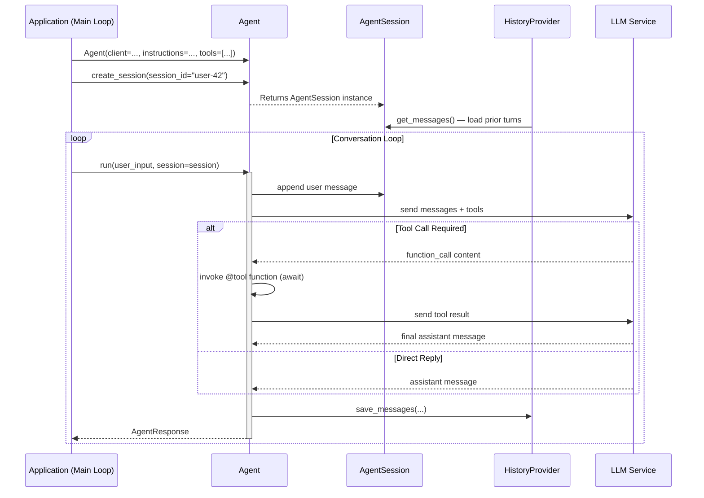
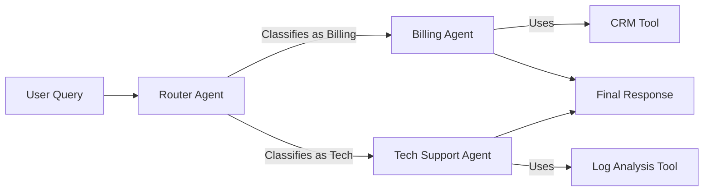
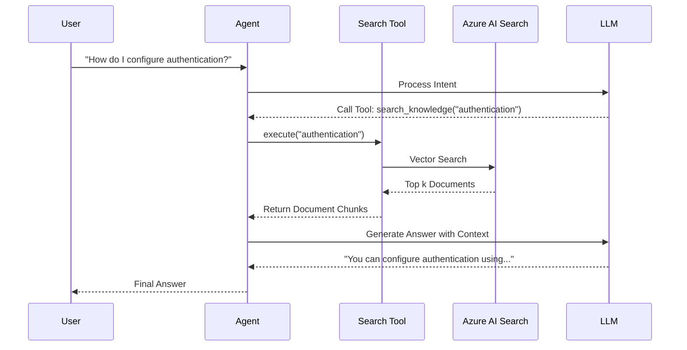

# Microsoft Agent Framework Python - Architecture Diagrams

This document provides visual references for the architecture, data flow, and deployment topology of Python-based agent systems.

**Target Platform:** Python 3.10+

---

## 1. System Architecture

### High-Level Layered Design

```mermaid
graph TD
    User[User / Client App] --> API[FastAPI / Flask Interface]
    
    subgraph "Agent Framework (Python)"
        API --> Orchestrator[Orchestrator / Workflow]
        Orchestrator --> AgentA[Agent A]
        Orchestrator --> AgentB[Agent B]
        
        AgentA --> Memory[Memory Store]
        AgentA --> Tools[Tools / Plugins]
        
        Tools --> PythonFunc[Python Functions]
        Tools --> AzureAI[Azure AI Services]
    end
    
    AgentA --> LLM[LLM Service (OpenAI)]
    Memory --> VectorDB[Vector Database]
```

---

## 2. Agent Lifecycle (AsyncIO)

The lifecycle of a Python agent within an `asyncio` event loop. State across turns is held in an `AgentSession` (paired with a `HistoryProvider` like `InMemoryHistoryProvider` or `FileHistoryProvider`).



---

## 3. Multi-Agent Orchestration (Router Pattern)

A common pattern where a router agent dispatches tasks to specialized agents.



---

## 4. Deployment Architecture (Azure Container Apps)

Recommended production topology for Python agents.

```mermaid
graph TD
    Internet((Internet)) --> FrontDoor[Azure Front Door]
    FrontDoor --> ACAEnv[Azure Container Apps Environment]
    
    subgraph "ACA Environment (VNet)"
        Ingress[Ingress Controller] --> Service[Python Agent Service (Gunicorn)]
        
        Service -->|Scale Out| Replica1[Replica 1]
        Service -->|Scale Out| Replica2[Replica 2]
        Service -->|Scale Out| ReplicaN[Replica N]
    end
    
    Replica1 --> KeyVault[Azure Key Vault]
    Replica1 --> OpenAI[Azure OpenAI]
    Replica1 --> Cosmos[Cosmos DB (Memory)]
    
    KEDA[KEDA Scaler] -->|Monitors| Service
    KEDA -.->|Metrics| AzureMonitor[Azure Monitor]
```

---

## 5. RAG Data Flow

Retrieval-Augmented Generation flow using Python and Azure AI Search.



---

## 6. Auto-generating Workflow Diagrams with `WorkflowViz`

Every `Workflow` produced by `WorkflowBuilder` (or any orchestration builder — `SequentialBuilder`, `ConcurrentBuilder`, `HandoffBuilder`, `GroupChatBuilder`, `MagenticBuilder`) can be visualized at runtime via `agent_framework.WorkflowViz`. No separate import needed for diagram generation; for SVG/PNG/PDF export install `graphviz` (`pip install graphviz>=0.20.0` plus the system `dot` binary).

```python
from agent_framework import Agent, AgentExecutor, WorkflowBuilder, WorkflowViz
from agent_framework.openai import OpenAIChatClient


client = OpenAIChatClient()
researcher = AgentExecutor(Agent(client=client, name="researcher"))
analyst = AgentExecutor(Agent(client=client, name="analyst"))
writer = AgentExecutor(Agent(client=client, name="writer"))

workflow = (
    WorkflowBuilder(start_executor=researcher, name="research-pipeline")
    .add_edge(researcher, analyst)
    .add_edge(analyst, writer)
    .build()
)

viz = WorkflowViz(workflow)

# Mermaid (no system dependencies — paste straight into Markdown / docs)
print(viz.to_mermaid())

# Graphviz DOT (use any DOT renderer)
print(viz.to_digraph())

# Render to a file — needs the graphviz Python package + the dot binary on PATH
viz.save_svg("workflow.svg")            # convenience wrapper
viz.save_png("workflow.png")
viz.export(format="pdf", filename="workflow.pdf")

# Include the framework's auto-injected glue executors for debugging:
viz.export(format="svg", filename="workflow-debug.svg", include_internal_executors=True)
```

`include_internal_executors=False` (default) hides the framework's plumbing nodes (start dispatchers, conversation marshalling) so the diagram matches what you wrote in the builder. Flip to `True` when you're debugging why a message isn't reaching its target.

`WorkflowViz` is marked release-candidate (`ReleaseCandidateFeature.WORKFLOW_VIZ`); using it emits a `FeatureStageWarning` once per process. Silence it with `warnings.filterwarnings("ignore", category=FeatureStageWarning)` if you regenerate diagrams in CI.

### Sub-workflow rendering

`WorkflowExecutor` (a workflow nested inside another workflow as a node) renders as a separate cluster under the parent diagram. The viz walks the composition tree automatically, so a multi-level workflow round-trips into a Mermaid graph that mirrors the actual call hierarchy.

### Visualizing the orchestration builders

Every orchestration builder (`SequentialBuilder`, `ConcurrentBuilder`, `HandoffBuilder`, `GroupChatBuilder`, `MagenticBuilder`) returns the same `Workflow` object, so all five render the same way. The diagrams reveal the hidden glue executors each builder injects — useful for debugging "why is my message not arriving?":

```python
from agent_framework import WorkflowViz
from agent_framework_orchestrations import (
    ConcurrentBuilder,
    HandoffBuilder,
    SequentialBuilder,
)

# Sequential — A → B → C with implicit conversation marshalling
sequential = SequentialBuilder(participants=[researcher, analyst, writer]).build()
print(WorkflowViz(sequential).to_mermaid())

# Concurrent — fan-out → participants → fan-in → aggregator
concurrent = ConcurrentBuilder(participants=[researcher, analyst, writer]).build()
print(WorkflowViz(concurrent).to_mermaid())

# Handoff — mesh between specialists, dispatcher node owns the user
handoff = (
    HandoffBuilder(participants=[triage, billing, technical])
    .add_handoff(triage, [billing, technical])
    .with_start_agent(triage)
    .build()
)
print(WorkflowViz(handoff).to_mermaid())
```

Toggle `include_internal_executors=True` on any of these to see the dispatcher / aggregator / collector nodes that the builders add — what the user wrote vs. what actually runs.

### Generating a CI artifact

Render diagrams during CI so PR reviewers can see how the topology changed without running anything:

```python
# scripts/render_workflow_diagrams.py
from pathlib import Path
import warnings
from agent_framework import WorkflowViz
from agent_framework._feature_stage import FeatureStageWarning

from myapp.workflows import build_research_workflow, build_support_workflow

# Suppress the once-per-process feature-stage warning so CI logs stay clean.
warnings.filterwarnings("ignore", category=FeatureStageWarning)

OUT = Path("docs/workflows")
OUT.mkdir(parents=True, exist_ok=True)

for name, factory in [("research", build_research_workflow), ("support", build_support_workflow)]:
    wf = factory()
    viz = WorkflowViz(wf)
    (OUT / f"{name}.mmd").write_text(viz.to_mermaid())            # markdown-friendly
    (OUT / f"{name}.dot").write_text(viz.to_digraph())            # for tooling
    viz.save_svg(str(OUT / f"{name}.svg"))                          # if graphviz installed
```

Wire the script into your release pipeline; commit the `.mmd` files and let your docs site (Astro, Docusaurus, MkDocs) render them inline.

### DOT vs Mermaid — when to pick which

- **Mermaid** — paste into any Markdown renderer (GitHub, GitLab, Astro Starlight, MkDocs Material). No system dependencies; the renderer downloads the JS at view time. Good for docs.
- **DOT / Graphviz** — needs the `dot` binary on PATH. Better when you want PDF output for design docs, hand-tuned layouts (`rankdir=LR`), or you need to feed the graph into other Graphviz-aware tools (e.g. `gvpr`).
- **`include_internal_executors=True`** for either — turn on while debugging, off for the final docs.

### Inspecting nodes and edges programmatically

`WorkflowViz` is a thin wrapper over the workflow's edge groups. When you need to drive your own renderer (a custom React diagram, a topology validator), reach into the underlying `Workflow` instead:

```python
from agent_framework import FanInEdgeGroup, FanOutEdgeGroup, SwitchCaseEdgeGroup

for group in workflow.edge_groups:
    if isinstance(group, FanOutEdgeGroup):
        print(f"fan-out from {group.source_id} → {group.target_ids}")
    elif isinstance(group, FanInEdgeGroup):
        print(f"fan-in {group.source_ids} → {group.target_id}")
    elif isinstance(group, SwitchCaseEdgeGroup):
        for case in group.cases:
            print(f"{group.source_id} -[case]-> {case.target_id}")
```

Pair with `workflow.executors` (a dict keyed by executor id) to enrich each node with type info, descriptions, or input/output type annotations from `executor.input_types`.

